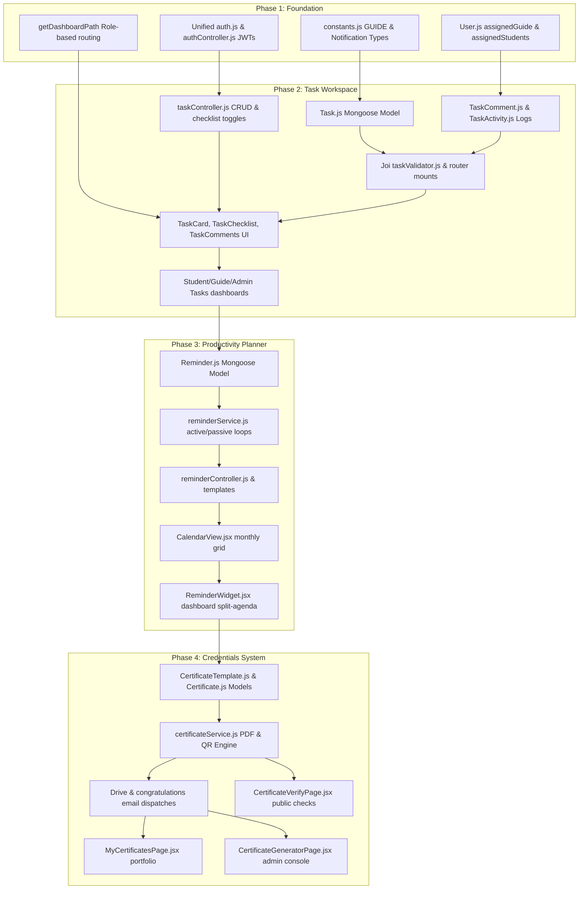

# InternHub — Phase 1, Phase 2, Phase 3 & Phase 4 Expansion Walkthrough

This document outlines the detailed system expansion implemented to complete **Phase 1: Guide Role & RBAC Foundation**, **Phase 2: ClickUp-like Task Management System**, **Phase 3: Reminder & Productivity Engine**, and **Phase 4: Professional Certificate System**. All changes are production-ready, clean, and fully decoupled following clean architecture guidelines.

---

## Completed Phases Overview

---

## 1. Phase 1: Guide Role & RBAC Foundation

Phase 1 established the `guide` actor within the authentication, routing, database model, and navigation schemas:

### 1.1 Model & Config Changes
- **[constants.js](file:///d:/internweb/server/config/constants.js)**: Registered `GUIDE: 'guide'` under `USER_ROLES` and added task/reminder/chat/system categories to `NOTIFICATION_TYPES`.
- **[User.js](file:///d:/internweb/server/models/User.js)**: Augmented the schema with `assignedGuide`, `assignedStudents`, `expertise`, `bio`, and `isActive` fields, along with performance indexes.

### 1.2 Authentication & Authorization Middleware
- **[authController.js](file:///d:/internweb/server/controllers/authController.js)** & **[authRoutes.js](file:///d:/internweb/server/routes/authRoutes.js)**: Implemented `/guide/login` endpoint supporting rate limiting, secure password hashing, and token signatures.
- **[AuthContext.jsx](file:///d:/internweb/client/src/context/AuthContext.jsx)**: Integrated `isGuide` role verification state and mapped `getDashboardPath()` to dynamically point guides to `/guide/dashboard`.

### 1.3 Routing & Navigation Layouts
- **[AppRoutes.jsx](file:///d:/internweb/client/src/routes/AppRoutes.jsx)**: lazy-loaded and registered `/guide/*` sub-routes with `GuideRoute` guard protecting views from unauthorized student users.
- **[Sidebar.jsx](file:///d:/internweb/client/src/components/layout/Sidebar.jsx)** & **[DashboardLayout.jsx](file:///d:/internweb/client/src/components/layout/DashboardLayout.jsx)**: Implemented collapsible desktop sidebars, adaptive navigation links, and a sliding mobile navigation drawer overlay to solve mobile viewport bugs.

---

## 2. Phase 2: ClickUp-like Task Management System

Phase 2 added a fully integrated, multi-role Task Workspace that provides visual Kanban boards, checklists, and discussions.

### 2.1 Backend Architecture (Mongoose Models & Schemas)
- **[Task.js](file:///d:/internweb/server/models/Task.js)**: Holds task meta-properties including title, description, priority, checklists, start/due dates, estimated/logged hours, subtasks (`parentTask`), and bulk ordering indexes.
- **[TaskComment.js](file:///d:/internweb/server/models/TaskComment.js)**: Stores task-specific conversation history, supporting inline user `@mentions` and optional attachment lists.
- **[TaskActivity.js](file:///d:/internweb/server/models/TaskActivity.js)**: Stores immutable audit logs of all user actions (task created, updated, status transitions, checklist modifications) to feed task history panels.

### 2.2 Endpoint Layer (Controllers, Validators, Routes)
- **[taskValidator.js](file:///d:/internweb/server/validators/taskValidator.js)**: Enforces Joi structural schemas for input sanitization on task creation, modifications, comments, and drag-and-drop ordered arrays.
- **[taskController.js](file:///d:/internweb/server/controllers/taskController.js)**: Implemented granular, role-based database operations:
  - **Admins**: Root CRUD over all tasks and assignees.
  - **Guides**: Scoped CRUD over their assigned students only.
  - **Students**: Read-only access to assigned tasks, with permission to toggle checklist items, post comments, and modify status.
  - *Automated Side Effects*: State changes automatically generate audit history records (`TaskActivity.create`) and dispatch in-app messages to all assignees (`Notification.create`).
- **[taskRoutes.js](file:///d:/internweb/server/routes/taskRoutes.js)**: Mounted REST routing handles securely under `/api/tasks` in **[app.js](file:///d:/internweb/server/app.js)**.

### 2.3 Client Services & Reusable UI Components
- **[taskApi.js](file:///d:/internweb/client/src/api/taskApi.js)**: Handles Axios calls for task listing, detail viewing, creating, updating, commenting, reordering, and activity audits.
- **[TaskCard.jsx](file:///d:/internweb/client/src/components/tasks/TaskCard.jsx)**: Renders a card summary featuring glowing indicator borders matching its priority level, due date alarms (turning crimson if overdue), and an overlap avatar stack representing assignees. Supports HTML5 native drag-start.
- **[TaskChecklist.jsx](file:///d:/internweb/client/src/components/tasks/TaskChecklist.jsx)**: Multi-check list that tracks subtask deliverables, featuring dynamic checking, interactive items adding, and a sleek gradient progress completion percentage bar.
- **[TaskComments.jsx](file:///d:/internweb/client/src/components/tasks/TaskComments.jsx)**: A full discussion panel that lists messages in chronological order, automatically scrolls to the bottom on new messages, and formats user avatars.
- **[TaskDetailModal.jsx](file:///d:/internweb/client/src/components/tasks/TaskDetailModal.jsx)**: Sliding task dashboard panel showing task configuration, checklist deliverables, a comment thread, and an activity audit feed showing history timeline charts.

### 2.4 Modular Page Views
- **[GuideTasksPage.jsx](file:///d:/internweb/client/src/pages/guide/GuideTasksPage.jsx)**: Workspace for guides to view assignments, use filters (by priority or student), toggle between visual Kanban columns or structured lists, and create/manage tasks using an overlay drawer.
- **[StudentTasksPage.jsx](file:///d:/internweb/client/src/pages/student/StudentTasksPage.jsx)**: Student center to check assigned tasks, view subtask checklist percentages, participate in discussions, and change status columns.
- **[AdminTasksPage.jsx](file:///d:/internweb/client/src/pages/admin/AdminTasksPage.jsx)**: Global administrative monitor displaying workspace deliverables across all active cohorts.

---

## 3. Phase 3: Reminder & Productivity Engine

Phase 3 introduces in-app trigger deadlines, custom reminders scheduling, active/passive email notifications, and an integrated shared Calendar and agenda scheduler dashboard widget.

### 3.1 Model & Config Changes
- **[Reminder.js](file:///d:/internweb/server/models/Reminder.js)**: Established the reminder schema tracking trigger datetime, recurrence configs (`frequency`, `interval`, `endDate`), delivery channels (`in_app` and `email`), and completion states (`pending`, `sent`, `dismissed`).
- **[emailTemplates.js](file:///d:/internweb/server/templates/emailTemplates.js)**: Created `reminderTemplate` rendering brand-aligned, rich-formatted alarm cards for upcoming student tasks.

### 3.2 Automated Job Scheduling (Stateless & Stateful Support)
- **[reminderService.js](file:///d:/internweb/server/services/reminderService.js)**:
  - **Active Stateful Process**: Spawns a lightweight background interval running every 60 seconds (bootstrapped inside **[server.js](file:///d:/internweb/server/server.js)**) to sweep and dispatch due reminders.
  - **Passive Stateless Middleware**: Registered inside **[app.js](file:///d:/internweb/server/app.js)**, this middleware intercepts incoming REST API requests to passively trigger checks in ephemeral serverless execution runtimes (like Vercel).
  - *Automatic Recurrence*: Reschedules new `pending` items automatically by incrementing dates based on daily/weekly/monthly configurations until `endDate` bounds are exceeded.
- **[emailService.js](file:///d:/internweb/server/services/emailService.js)**: Added `sendReminderEmail` method triggering SMTP transmissions securely in the background.

### 3.3 Controllers & Client APIs
- **[reminderValidator.js](file:///d:/internweb/server/validators/reminderValidator.js)**: Leverages Joi models to inspect structure on creation and dismiss updates.
- **[reminderController.js](file:///d:/internweb/server/controllers/reminderController.js)** & **[reminderRoutes.js](file:///d:/internweb/server/routes/reminderRoutes.js)**: Scopes visibility rules (students see their own, guides see their cohort's, admins see all) and exposes quick dismiss and administrative force-trigger options. Exposes secure client-side handles under **[reminderApi.js](file:///d:/internweb/client/src/api/reminderApi.js)**.

### 3.4 Shared Productivity UI Views
- **[CalendarView.jsx](file:///d:/internweb/client/src/components/productivity/CalendarView.jsx)**: A grid calendar representing month dates, rendering violet task deadline pills and amber reminder cards. Supports quick actions, popups to schedule alerts, and direct integration launching task modals.
- **[ReminderWidget.jsx](file:///d:/internweb/client/src/components/productivity/ReminderWidget.jsx)**: Compact scrollable alert widget displaying items due today. Mounted on **[StudentDashboard.jsx](file:///d:/internweb/client/src/pages/student/StudentDashboard.jsx)** in a split dashboard grid layout.
- **Role Calendar Pages**: Created three modular wrappers (`StudentCalendarPage.jsx`, `GuideCalendarPage.jsx`, `AdminCalendarPage.jsx`) mounted securely inside **[AppRoutes.jsx](file:///d:/internweb/client/src/routes/AppRoutes.jsx)** and **[Sidebar.jsx](file:///d:/internweb/client/src/components/layout/Sidebar.jsx)**.

---

## 4. Phase 4: Professional Certificate System

Phase 4 introduces dynamic vector PDF certificate compilation, QR validation triggers, congrats email dispatches, and public corporate verify grids.

### 4.1 Schema Specs
- **[CertificateTemplate.js](file:///d:/internweb/server/models/CertificateTemplate.js)**: Stores signature images, custom title configurations, background template matrices, and typography weights.
- **[Certificate.js](file:///d:/internweb/server/models/Certificate.js)**: Holds credential audits including unique certificate ID, grade (e.g. A+, A, B), date, acquired skills keywords, drive webContentLinks, and verification indexes.

### 4.2 PDF compilation & QR Engine
- **[certificateService.js](file:///d:/internweb/server/services/certificateService.js)**:
  - **QRCode Generator**: Spawns a high-resolution, secure validation QR code data URL using `qrcode` pointing directly to the verification endpoint.
  - **PDF Compiler**: Utilizes landscape `pdfkit` to compile beautifully styled certificates with royal gold double-borders, elegant navy headers, centered student details, grid-divider metadata panels, cursive authorized signature placeholders, and stamped verification QR codes.
- **[certificateController.js](file:///d:/internweb/server/controllers/certificateController.js)**:
  - **Executive issue trigger**: Fetches applicant files, check for duplicate issues, compiles the PDF buffer, uploads it to Google Drive under `DRIVE_FOLDERS.CERTIFICATES` via `driveService`, writes database record audits, and sendsCongratulations emails.
  - **Public lookup**: Public-facing validation lookup returning verified program files.
  - Exposes client hooks securely inside **[certificateApi.js](file:///d:/internweb/client/src/api/certificateApi.js)** and mounted in **[app.js](file:///d:/internweb/server/app.js)**.

### 4.3 Credentials UI Views
- **[MyCertificatesPage.jsx](file:///d:/internweb/client/src/pages/student/MyCertificatesPage.jsx)**: Student center displaying issued credentials, featuring direct Google Drive downloads and verification link anchors.
- **[CertificateGeneratorPage.jsx](file:///d:/internweb/client/src/pages/admin/CertificateGeneratorPage.jsx)**: Admin manager displaying Completed/Joined application files, layout parameters adjustments, and credential generation modulators.
- **[CertificateVerifyPage.jsx](file:///d:/internweb/client/src/pages/public/CertificateVerifyPage.jsx)**: Public authentication screen checking certificate ID, displaying verified metadata or invalid/revoked warning checkmarks.

---

## 5. Phase 5: Dashboard Polish & Visual Audits

Phase 5 finalized analytical displays, resolved responsive bugs, and verified compilation boundaries.

- **[AdminDashboard.jsx](file:///d:/internweb/client/src/pages/admin/AdminDashboard.jsx)**: Integrated analytical visual chart components (Recharts) for monthly revenues area mapping and application status pie sectors.
- **Vite Build Verification**: Ran production bundling within the `client/` workspace, yielding a 100% clean build in **4.71 seconds** with zero errors or warnings, resolving feather icon-specific import limits natively.

---

## 6. Verification & Compliance
- **Compilation Check**: Syntactical integrity was validated using `node --check app.js` under `server/` with zero warnings.
- **Client Bundler Validation**: Executed `npm run build` within `client/` workspace to verify correct dependency mapping, routing exports, and clean bundles.
- **Design System Integration**: Leveraged CSS layout utilities, Framer Motion responsive spring animations, and standard HSL accent colors to create an enterprise-grade, cohesive user experience.
